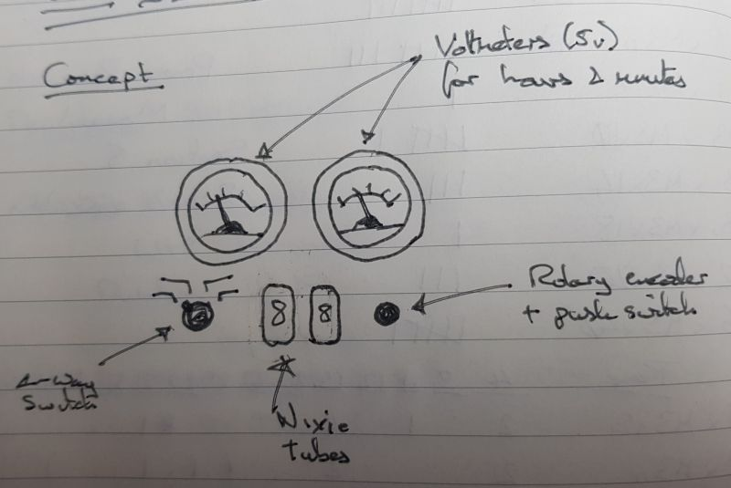
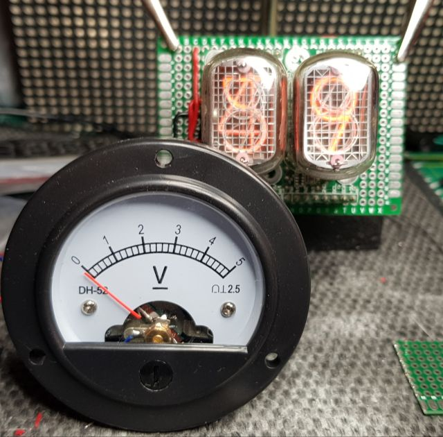

# RetroClock00
Arduino clock project with voltmeters and Nixie tubes

## Concept

I have a couple of IN12 Nixie tubes and a 5v to 170v Power supply that I bought
years ago. I never got around to putting them in a project because the power
supply has a serious coil hum issue. Recently, I found a 'Nixie Power' module
on ebay and it works great with the IN12 SmartNixie, so I am finally getting
around to this.

The work in progress. The IN12 Nixie tubes in the background are running in 
a built in test mode, looping through number at ~10 Hertz. One of the analogue
0-5v voltmeters in front.

## Hardware / Parts

Component                   |src | Cost    | Notes
----------------------------|----|---------|-------------------------------
Arduino Nano                | 1  | £3.33   | V3 Compatible ATMEGA328P CH340
PSU 5v-12v to 170v          | 2  | £7.38   | Nixie Power - from Hong Kong
Rotary Encoder Switch       | 1  | £0.30   | 12mm encoder and push switch
4-way switch                | 3  | £0.00   | Thanks, Will
SmartNixie IN12 x 2         | 4  | $14.00  | I2C controlled board and IN12
DS3231 Real Time Clock      | 1  | £3.00   | Very accurate RTC
Analogue Voltmeter DH52 x 2 | 5  | £1.50   | 0-5v, small, round, plastic.
Perf board, wire, etc       |    |         | I just accumulate this stuff
1000uf Capacitor            |    |         | I don't remember

### Sources
1. [Amazon UK](https://www.amazon.co,uk)
2. [Ebay UK](https://www.ebay.co.uk)
3. My friend William gave it to me for free.
4. [Taylor Electronics](https://www.shop-tes.com/smartnixie/display-module/)
5. [Aliexpress](https://www.aliexpress.com)
