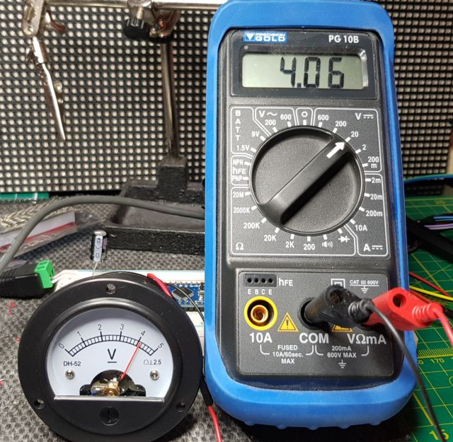
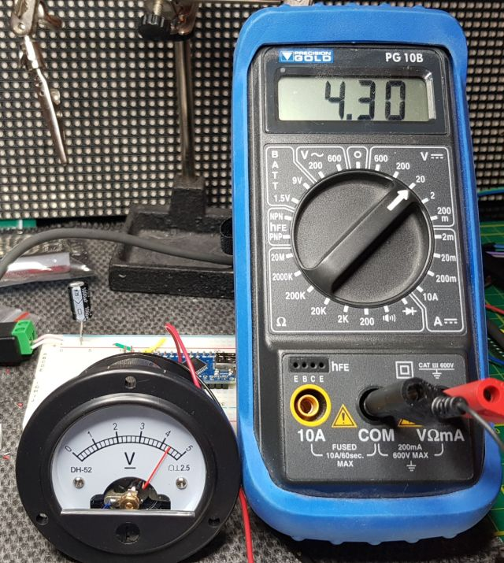
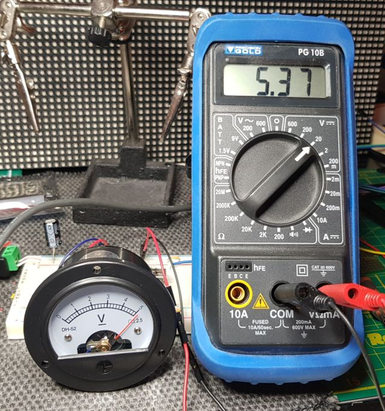
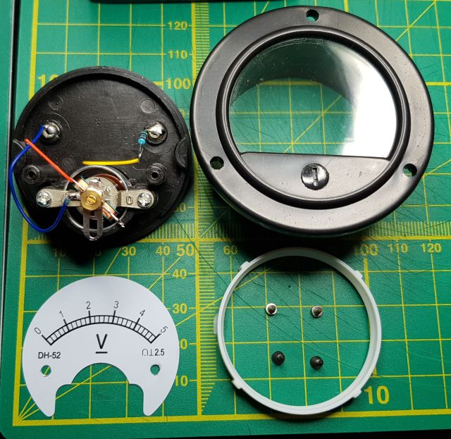

# Voltmeter

Experiments with the 0-5v Analogue Voltmeter DH-52.

My cunning plan is to use these voltmeters to display Hours and Minutes, driven
by two PWM outputs on the Arduino Nano.

Since I will have to replace (or cover up) the faceplates for this, I want
to 3D print the faceplate with thin white PLA so I can back light them with
a neopixel.

## PWM output versus voltmeter display

The analogue voltmeters should be 0 to 5v and my plan is to use an Arduino Nano
powered by a 5v transformer to drive them through the PWM pin.

In this experiment, I wrote a simple sketch 'PwmToVoltmeter', it steps up the
PWM output in 4 steps to the maximum PWM output on an analogue pin to the 
value 255.

Then I observed the readout on the voltmeter and on my multimeter. 

Input V                             | At voltmeter    | On multimeter
------------------------------------|-----------------|---------------
Ardiuno powered by USB - PWM 255    | Just over 4     | 4.06 V
Arduino powered from 5v 4a input    | 4 and 2         | 4.30 V
Directly for 5v 4a power supply     | Over 5          | 5.37 V

## Conclusions

### PWM can't output 5v

The Arduino Nano I have are cheap Chinese knock offs, not genuine Arduino
Nanos, so this may be a factor.

The output goes up when using 'vin' with over 5v, instead of just USB power.

The Nano can be powered with 5 to 9v on 'vin'. Higher input to the Arduino 
shouldn't impact the PWM output though.

### The voltmeter is accurate

The voltmeter and the multimeter seemed to agree, if you adjust for the scale
shown on the dial.

## Next steps

Opening up the voltmeter shows it has a 5K resister (I measured it). Replacing
that resister with 4K, should bring it into the range the PWM can output.

